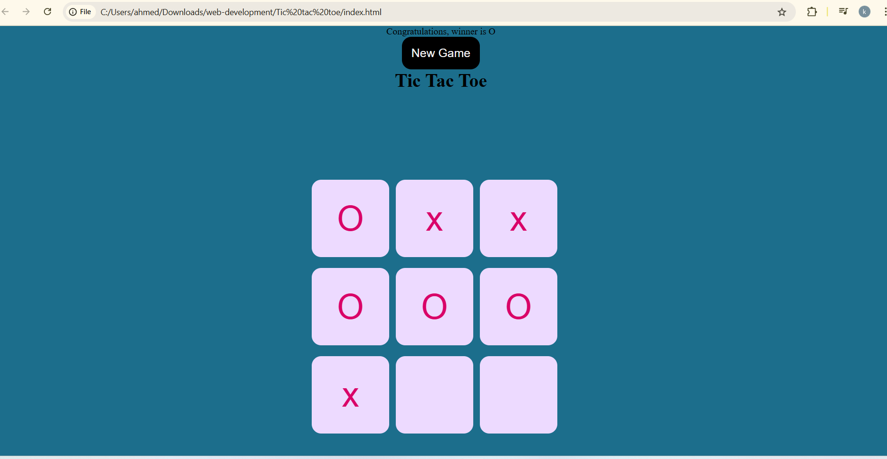

# 🎮 Tic Tac Toe Game



A classic Tic Tac Toe implementation with HTML, CSS, and JavaScript.

 ✨ Features
- Player vs Player gameplay
- Real-time win detection (8 winning patterns)
- Responsive design (works on mobile/desktop)
- Visual turn indicators
- Reset game functionality

🚀 Quick Start
1. Clone the repository:
   ```bash
   git clone https://github.com/kamran783/Tic-Tac-Toe-.git
